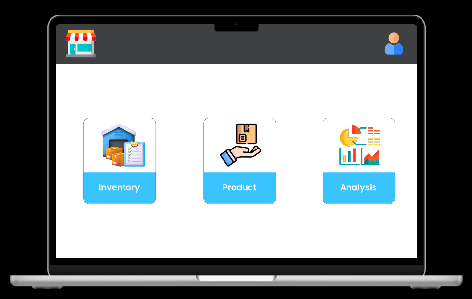

# StokMaster

[View Design on Figma](https://www.figma.com/design/lCan0Qb4h9X7kJDp9EcDDy/Untitled?node-id=0-1&t=jw1xY5HlTFUxXXo2-1)

## Overview

**StokMaster** adalah sistem manajemen inventaris yang dirancang untuk membantu bisnis dalam mengontrol, melacak, dan mengelola stok barang secara efektif. Aplikasi ini menawarkan antarmuka yang user-friendly dan fitur-fitur canggih untuk mengoptimalkan proses pengelolaan inventaris, mulai dari pemasukan barang baru hingga pelaporan stok.

## Fitur Utama

- **Manajemen Data Barang:** Input, edit, dan hapus data produk dengan mudah.
- **Pencatatan Transaksi:** Mencatat semua transaksi pembelian dan penjualan, serta pergerakan barang masuk dan keluar secara otomatis.
- **Laporan dan Analisis:** Menyediakan laporan untuk mendukung pengambilan keputusan strategis, seperti laporan penjualan, stok minimum, dan tren produk.

## Teknologi yang Digunakan

- **Bahasa Pemrograman:** C#
- **Framework Web/GUI:** .Net
- **Database:** MySQL
